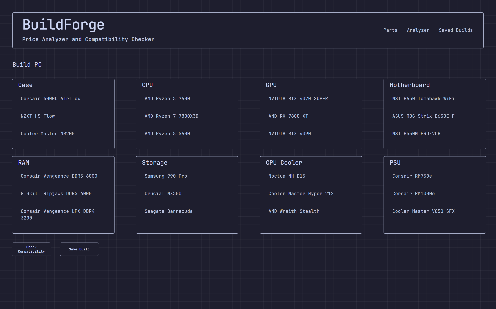
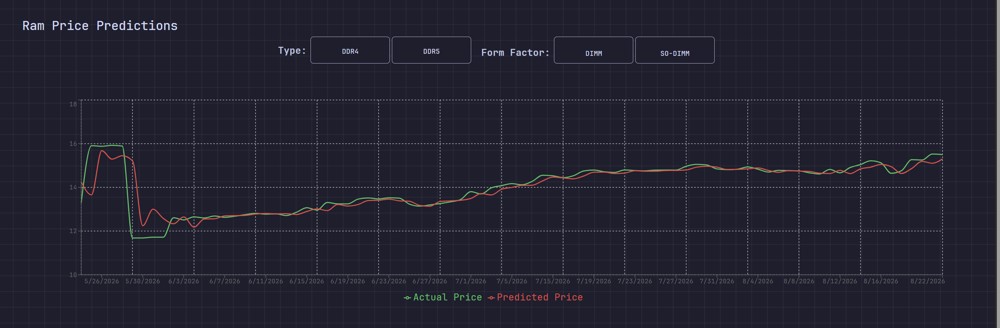

# YAPP - YET ANOTHER PRICE PREDICTOR

## Made With

### Backend

### Machine Learning

### DataBase

### Frontend

## Problem

Building a PC requires checking compatibility between multiple components, which can be confusing and time-consuming and in the recent times PC parts prices have inflated especially RAMs and Storage devices.

## Why I Made This

I wanted to build a tool that makes PC building easier by automatically checking component compatibility and help monitor the prices to plan a purchase.

## What It Solves

YAPP checks whether selected PC components can work together, identifies compatibility issues, and aims to help users make better purchasing decisions based on component prices.

## Machine Learning

### Overview
To predict future RAM unit prices per GB (`avg_price_per_gb`), a machine learning pipeline was constructed using `scikit-learn`. The model ingests lagged time-series statistics and structural metadata to evaluate trends over time.

---

### Feature Engineering & Pipeline

**Categorical Features (One-Hot Encoded):**
* `ram_type` (e.g., DDR4, DDR5)
* `form_factor` (e.g., DIMM, SO-DIMM)

**Numerical Features (Passed Through):**
* `previous_price`
* `prev_7_day_price`, `prev_month_price`
* `prev_7_day_price_avg`, `prev_month_price_avg`
* `price_diff_1_d`, `prce_diff_1_d_pct`, `7d_displacement`

The preprocessing steps (`ColumnTransformer`) and model estimator are encapsulated inside a scikit-learn `Pipeline` to prevent data leakage and ensure seamless inference.

---

### Dataset Splitting & Evaluation Strategy

Because price tracking is sequential and time-sensitive, a standard random $K$-Fold cross-validation would cause data leakage from future dates into past evaluations. 

Instead, a strictly chronological **80:20 Train-Test split** was used:
* **Train Set (80%):** Historical price sequences used to fit models.
* **Test Set (20%):** Unseen future pricing data to validate real-world predictive power.

---

### Models Tested

| Estimator | Train $R^2$ | Test $R^2$ | Test MAE | Test RMSE | Verdict / Notes |
| :--- | :---: | :---: | :---: | :---: | :--- |
| **Linear Regression** | **0.9832** | **0.8417** | **0.1232** | **0.1892** | **Selected.** Best balance of extrapolation & speed. |
| **Lasso Regression** ($\alpha=0.01$) | — | 0.8364 | — | — | Comparable to Linear Regression via feature pruning. |
| **Ridge Regression** ($\alpha=1.0$) | — | 0.8350 | — | — | $L_2$ penalty slightly underperformed pure linear fit. |
| **Random Forest** | — | -0.9588 | — | — | Overfits; fails to extrapolate beyond historical min/max values. |
| **XGBoost Regressor** | — | -2.9598 | — | — | Poor performance on unscaled time-series trend features. |

---

### Key Takeaways & Model Selection

* **Extrapolation Advantage:** Linear models naturally capture upward or downward trajectory trends beyond historical boundaries, making them better suited for price forecasting than decision trees.
* **Baseline Bias:** High initial $R^2$ values occur because today's price is strongly correlated with yesterday's price (`previous_price`). Evaluating strictly against future dates (chronological split) was required to measure true accuracy.
* **Selected Model:** Standard **Linear Regression** was selected and exported as a persistent artifact to `ml/models/linearRegressionModel.pkl` via `joblib`.

## Features

- PC component database
- Component selection
- Compatibility checking
- Detailed compatibility results
- Error handling
- REST API

## Frontend Screenshot

---

## Status

- [x] PostgreSQL database
- [x] FastAPI backend
- [x] Compatibility logic
- [x] Error handling
- [x] API responses
- [x] React frontend setup
- [x] Frontend UI
- [ ] Docker
- [x] AI/ML Price Analyzer
